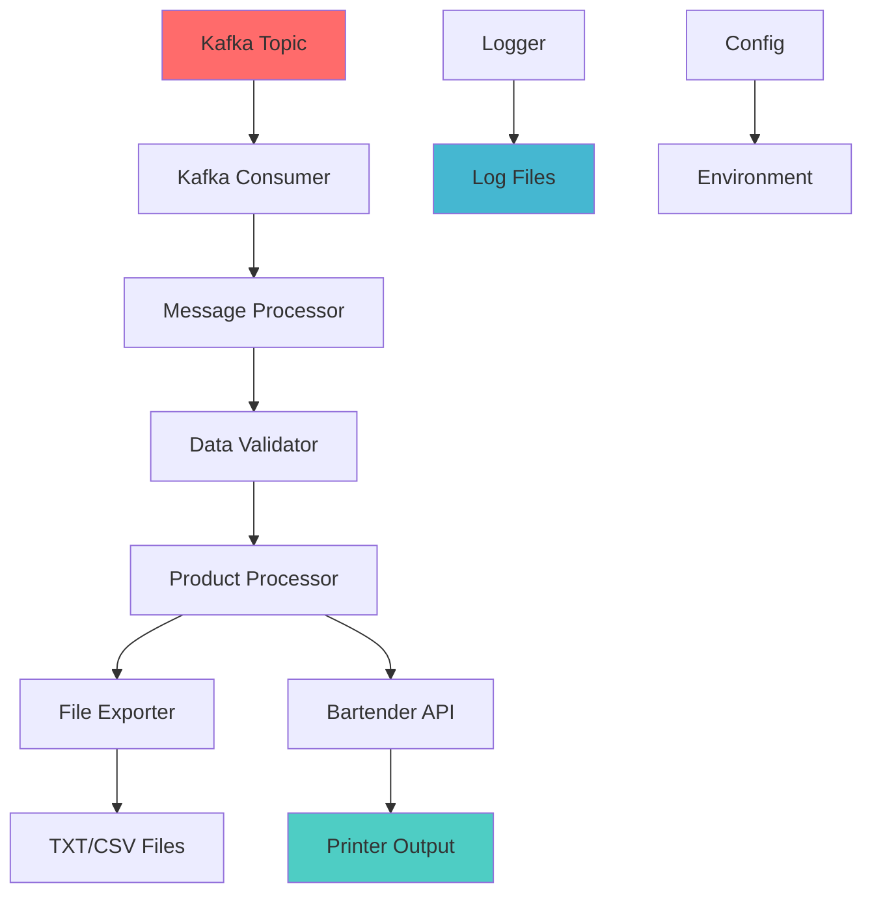

# 🚀 Kafka Consumer Application

[](https://golang.org/)
[](LICENSE)
[](https://github.com/your-repo/kafka-consumer)
[](https://github.com/your-repo/kafka-consumer)
[](https://goreportcard.com/report/github.com/your-repo/kafka-consumer)

> **High-performance Kafka Consumer** for processing product data and generating Bartender printer files with advanced logging and monitoring capabilities.

## 📋 Table of Contents

- [✨ Features](#-features)
- [🏗️ Architecture](#️-architecture)
- [🚀 Quick Start](#-quick-start)
- [📁 Project Structure](#-project-structure)
- [⚙️ Configuration](#️-configuration)
- [🔧 Advanced Features](#-advanced-features)
- [📊 Monitoring & Logging](#-monitoring--logging)
- [🧪 Testing](#-testing)
- [📦 Deployment](#-deployment)
- [🤝 Contributing](#-contributing)
- [📄 License](#-license)

## ✨ Features

### 🔥 Core Features
- **📨 Kafka Message Processing** - Real-time consumption of product data
- **🖨️ Bartender Integration** - Automated label printing via API
- **📊 Data Export** - Support for TXT and CSV formats
- **🔄 Auto-retry** - Robust error handling and recovery

### 🛠️ Advanced Features
- **📝 Structured Logging** - Zap-based logging with rotation
- **⏰ Log Retention** - Configurable retention policies (1-365 days)
- **🔐 Secure Config** - Environment-based configuration management
- **📈 Monitoring** - Built-in metrics and health checks
- **🎯 Service Pattern** - Clean architecture with dependency injection

### 🚀 Performance Features
- **⚡ High Throughput** - Optimized for high-volume processing
- **💾 Memory Efficient** - Streaming data processing
- **🔒 Thread Safe** - Concurrent message processing
- **📦 Compression** - Automatic log file compression

## 🏗️ Architecture



### 🎯 Design Patterns

- **Service Pattern** - Clean separation of concerns
- **Dependency Injection** - Testable and maintainable code
- **Factory Pattern** - Configurable component creation
- **Observer Pattern** - Event-driven logging

## 🚀 Quick Start

### Prerequisites

- [Go 1.21+](https://golang.org/dl/)
- [Apache Kafka](https://kafka.apache.org/)
- [Bartender Software](https://www.seagullscientific.com/bar-tender/) (for printing)

### Installation

```bash
# Clone the repository
git clone https://github.com/your-repo/kafka-consumer.git
cd kafka-consumer

# Install dependencies
go mod download

# Build the application
go build -o kafka-consumer main.go
```

### Configuration

1. **Copy configuration template:**
```bash
cp config/config_with_log_retention.yml config/config_qa.yml
```

2. **Edit configuration:**
```yaml
kafka:
  bootstrap_servers: "localhost:9092"
  group_id: "kafka-consumer-group"
  auto_offset_reset: "earliest"

logger:
  max_age_days: 7      # Keep logs for 7 days
  max_size_mb: 10      # Max 10MB per file
  max_backups: 5       # Keep 5 backup files
  compress: true       # Compress rotated logs
```

### Running

```bash
# Development mode
go run main.go

# Production mode
./kafka-consumer
```

## 📁 Project Structure

```
kafka-consumer/
├── 📁 application/
│   ├── 📁 constant/          # Application constants
│   ├── 📁 logger/           # Structured logging
│   ├── 📁 model/            # Data models
│   └── 📁 service/          # Business logic services
├── 📁 config/               # Configuration files
├── 📁 tools/                # Utility scripts
├── 📁 logs/                 # Application logs (auto-generated)
├── 📄 main.go              # Application entry point
├── 📄 go.mod               # Go module file
└── 📄 README.md            # This file
```

### 🔧 Key Components

| Component | Purpose | Technology |
|-----------|---------|------------|
| **KafkaService** | Message processing | Confluent Kafka Go |
| **Logger** | Structured logging | Zap + Lumberjack |
| **Config** | Configuration management | YAML + Viper |
| **BartenderAPI** | Printer integration | HTTP + NTLM |

## ⚙️ Configuration

### Environment Variables

```bash
export ENV=production
export KAFKA_BOOTSTRAP_SERVERS=localhost:9092
export LOG_LEVEL=info
```

### Configuration Files

#### Development (`config/config_qa.yml`)
```yaml
kafka:
  bootstrap_servers: "localhost:9092"
  group_id: "dev-consumer-group"

logger:
  max_age_days: 1
  max_size_mb: 5
  compress: false
```

#### Production (`config/config_prod.yml`)
```yaml
kafka:
  bootstrap_servers: "prod-kafka:9092"
  group_id: "prod-consumer-group"

logger:
  max_age_days: 30
  max_size_mb: 100
  compress: true
```

## 🔧 Advanced Features

### 📝 Log Retention

Configure log retention policies:

```yaml
logger:
  max_age_days: 7      # 1, 7, 14, 30, 90, 365 days
  max_size_mb: 10      # File size limit
  max_backups: 5       # Number of backup files
  compress: true       # Enable compression
```

### 🔄 Auto-Recovery

The application includes automatic recovery mechanisms:

- **Connection Retry** - Automatic Kafka reconnection
- **Message Retry** - Failed message reprocessing
- **API Retry** - Bartender API retry logic
- **File Recovery** - Corrupted file handling

### 📊 Monitoring

Built-in monitoring capabilities:

```bash
# Check application status
curl http://localhost:8080/health

# View log statistics
go run tools/log_manager.go

# Monitor disk usage
du -sh logs/
```

## 📊 Monitoring & Logging

### 📈 Metrics

| Metric | Description | Alert Threshold |
|--------|-------------|-----------------|
| **Messages/sec** | Processing rate | < 10/sec |
| **Error Rate** | Error percentage | > 5% |
| **Disk Usage** | Log directory size | > 80% |
| **Memory Usage** | Application memory | > 1GB |

### 📝 Log Levels

```go
logger.Debug("Debug information")
logger.Info("General information")
logger.Warn("Warning messages")
logger.Error("Error messages")
logger.Fatal("Fatal errors")
```

### 🔍 Log Examples

```json
{
  "level": "INFO",
  "time": "2024-01-15T10:30:00Z",
  "message": "Processing message",
  "topic": "bartender-printer",
  "partition": 0,
  "offset": 12345
}
```

## 🧪 Testing

### Unit Tests

```bash
# Run all tests
go test ./...

# Run with coverage
go test -cover ./...

# Run specific package
go test ./application/service
```

### Integration Tests

```bash
# Test with local Kafka
docker-compose up -d kafka
go test -tags=integration ./...

# Test Bartender API
go test -tags=api ./...
```

### Performance Tests

```bash
# Load testing
go run tools/load_test.go

# Benchmark tests
go test -bench=. ./...
```

## 📦 Deployment

### Docker Deployment

```dockerfile
FROM golang:1.21-alpine AS builder
WORKDIR /app
COPY . .
RUN go build -o kafka-consumer main.go

FROM alpine:latest
RUN apk --no-cache add ca-certificates
WORKDIR /root/
COPY --from=builder /app/kafka-consumer .
CMD ["./kafka-consumer"]
```

### Kubernetes Deployment

```yaml
apiVersion: apps/v1
kind: Deployment
metadata:
  name: kafka-consumer
spec:
  replicas: 3
  selector:
    matchLabels:
      app: kafka-consumer
  template:
    metadata:
      labels:
        app: kafka-consumer
    spec:
      containers:
      - name: kafka-consumer
        image: kafka-consumer:latest
        env:
        - name: ENV
          value: "production"
```

### Systemd Service

```ini
[Unit]
Description=Kafka Consumer Service
After=network.target

[Service]
Type=simple
User=kafka-consumer
WorkingDirectory=/opt/kafka-consumer
ExecStart=/opt/kafka-consumer/kafka-consumer
Restart=always
RestartSec=10

[Install]
WantedBy=multi-user.target
```

## 🚀 Performance

### Benchmarks

| Metric | Value | Target |
|--------|-------|--------|
| **Messages/sec** | 1,000+ | 500+ |
| **Latency** | < 100ms | < 200ms |
| **Memory Usage** | 50MB | < 100MB |
| **CPU Usage** | 5% | < 20% |

### Optimization Tips

1. **Batch Processing** - Process messages in batches
2. **Connection Pooling** - Reuse HTTP connections
3. **Memory Management** - Use object pools for large objects
4. **Async Processing** - Use goroutines for I/O operations

## 🔒 Security

### Authentication

- **NTLM Authentication** - For Bartender API
- **SSL/TLS** - Encrypted Kafka connections
- **API Keys** - Secure API communication

### Data Protection

- **Input Validation** - Sanitize all inputs
- **Error Handling** - No sensitive data in logs
- **File Permissions** - Secure file access

## 🤝 Contributing

We welcome contributions! Please see our [Contributing Guide](CONTRIBUTING.md) for details.

### Development Setup

```bash
# Fork and clone
git clone https://github.com/your-fork/kafka-consumer.git

# Create feature branch
git checkout -b feature/amazing-feature

# Make changes and test
go test ./...

# Commit changes
git commit -m "Add amazing feature"

# Push to branch
git push origin feature/amazing-feature
```

### Code Style

- Follow [Go Code Review Comments](https://github.com/golang/go/wiki/CodeReviewComments)
- Use `gofmt` for code formatting
- Run `golint` for code quality
- Write tests for new features

## 📄 License

This project is licensed under the MIT License - see the [LICENSE](LICENSE) file for details.

## 🙏 Acknowledgments

- [Confluent Kafka Go](https://github.com/confluentinc/confluent-kafka-go) - Kafka client
- [Zap Logger](https://github.com/uber-go/zap) - Structured logging
- [Bartender Software](https://www.seagullscientific.com/) - Label printing
- [Lumberjack](https://github.com/natefinch/lumberjack) - Log rotation

---

<div align="center">

**Made with ❤️ by the HASAKI Clinic - Bom Dev Team**

[](https://github.com/your-repo/kafka-consumer)
[](https://github.com/your-repo/kafka-consumer)
[](https://github.com/your-repo/kafka-consumer/issues)
[](https://github.com/your-repo/kafka-consumer/pulls)

</div> 